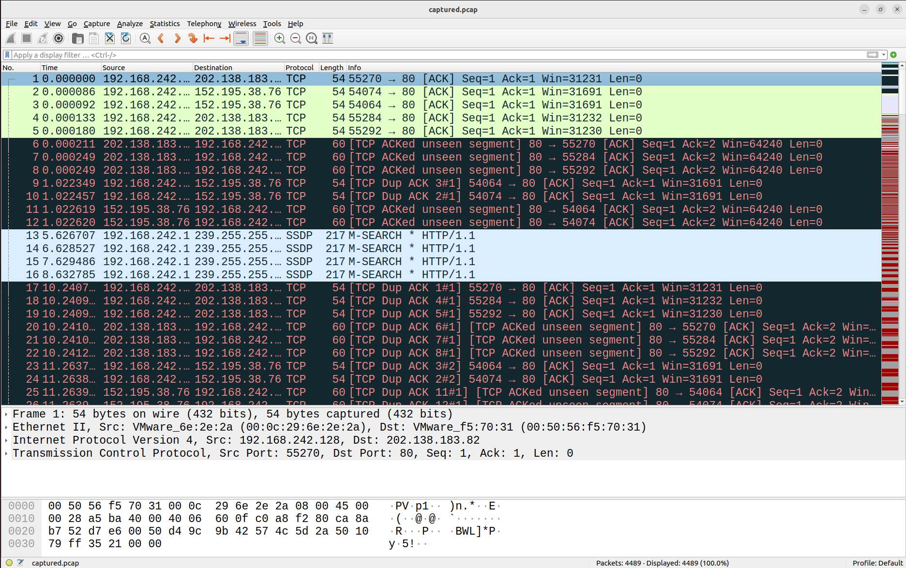
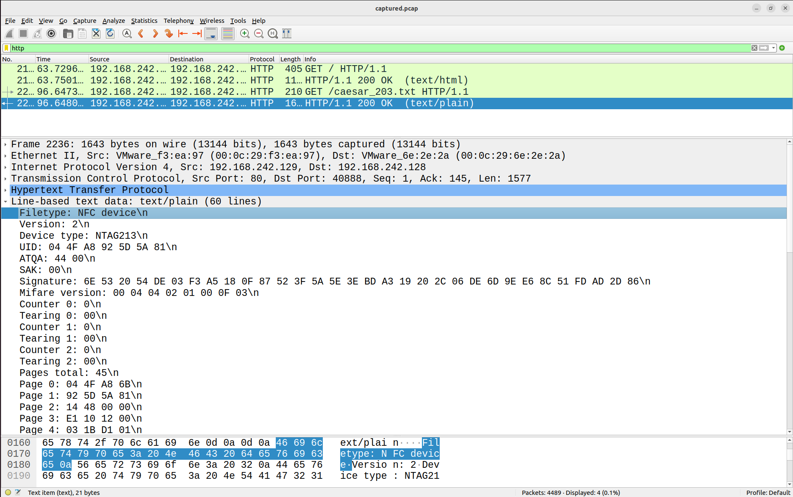
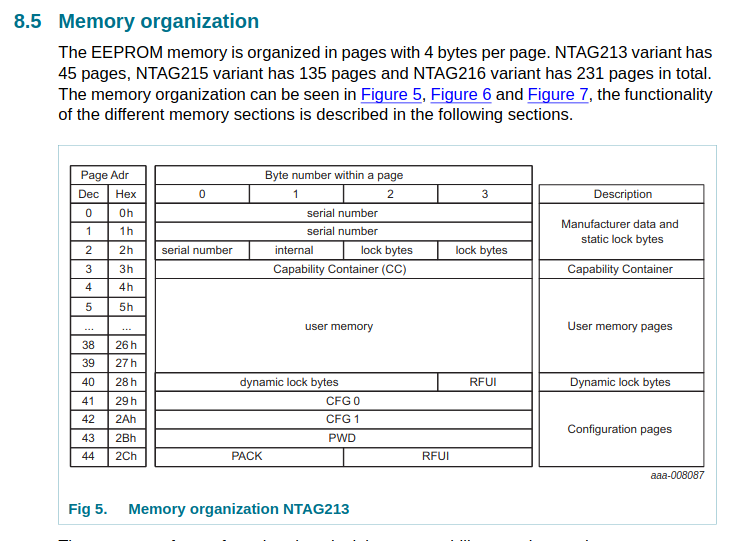
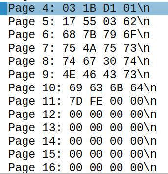
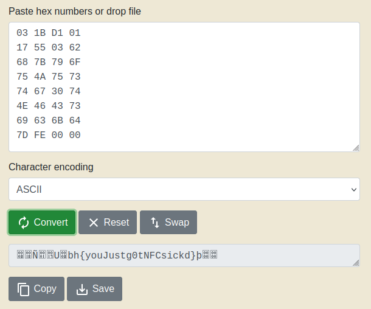

<h1> Misc - I Lost my Tesla NFC Card </h1>

**Table of contents**
- [Description](#description)
- [Solution](#solution)
  - [HTTP protocol](#http-protocol)
  - [NFC device](#nfc-device)
  - [Analyzing the NFC data](#analyzing-the-nfc-data)

## Description
Oh no! I lost my Tesla NFC Card and I can’t open my car. Luckily, I was able to hack into my hotel network which contains my NFC data. Can you please retrieve it? 
Translated to Japanese:
大変だ！テスラのNFCカードをなくしてしまい、車を開けれなくなりました。ホテルのネットワークにハッキングして私のNFCデータを取得しました。データを取り出してもらえますか？

## Solution
To analyze the given `captured.pcap` packet network data, I used wireshark.
 

 

### HTTP protocol

> Hypertext Transfer Protocol (HTTP) is an application-layer protocol for transmitting hypermedia documents, such as HTML. **It was designed for communication between web browsers and web servers**, but it can also be used for other purposes. HTTP follows a classical client-server model, with a client opening a connection to make a request, then waiting until it receives a response. HTTP is a stateless protocol, meaning that the server does not keep any data (state) between two requests.[^1]

HTTP protocol is used to encode and transport data from user(via web browser) to a server. According to the [description](#description), the user probably uploaded the NFC data to the network. Therefore, I filtered the HTTP protocol data package and found NFC device filetype package.
 

 

### NFC device
From the image above, the NFC device type used was NTAG213.
Each page address of the NFC data represents how the data is stored in memory.
This NXP NTAG213 datasheet shows how the memory organization of NTAG213.
 

 
https://www.nxp.com/docs/en/data-sheet/NTAG213_215_216.pdf

### Analyzing the NFC data
The data of the NFC device is stored in user memory from page 4 to 39. The data of this NFC device is shown below. o find the flag, I converted this data from hexadecimal to ASCII code and found the flag which is `bh{youJustg0tNFCsickd}`.
 

 

 
**Flag : bh{youJustg0tNFCsickd}**
[^1]: https://developer.mozilla.org/en-US/docs/Web/HTTP
