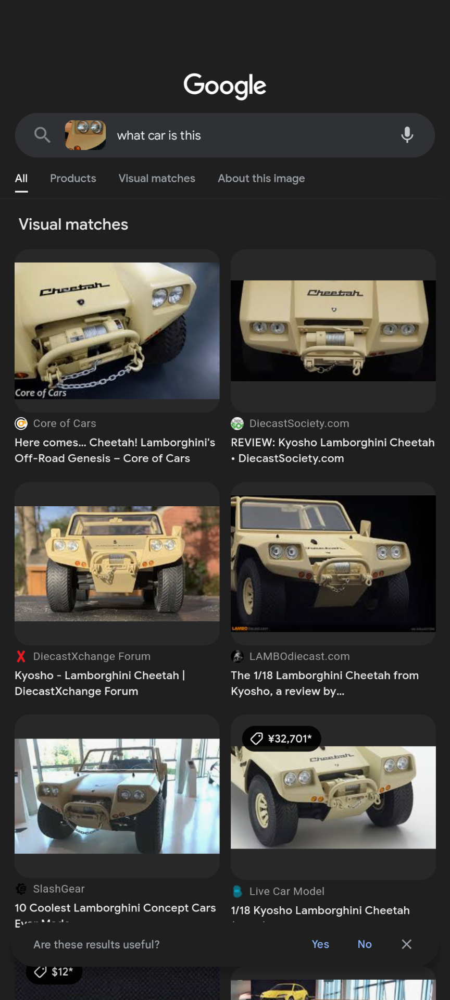

<h1> OSINT - I know a lot about cars </h1>

**Table of Contents**
- [Description](#description)
- [Solution](#solution)

## Description
You say you know your cars. Let’s check how well you know them. What is the make and model of this vehicle? Write the answer using the following format: Make Model. For example: bh{Volkswagen_Beetle} 
Translated to Japanese:
あなたは車に詳しいと言っていますが、それではどれだけ詳しいか確認してみましょう。この車のメーカーとモデルは何ですか？次の形式で回答してください：Make Model。例えば：bh{Volkswagen_Beetle}

## Solution
Since I don't know a lot about cars, I used Google Lens to identify the given image. Google Lens' visual match shows that this is Lamborghini Cheetah. 
**Flag : bh{Lamborghini_Cheetah}**
 
