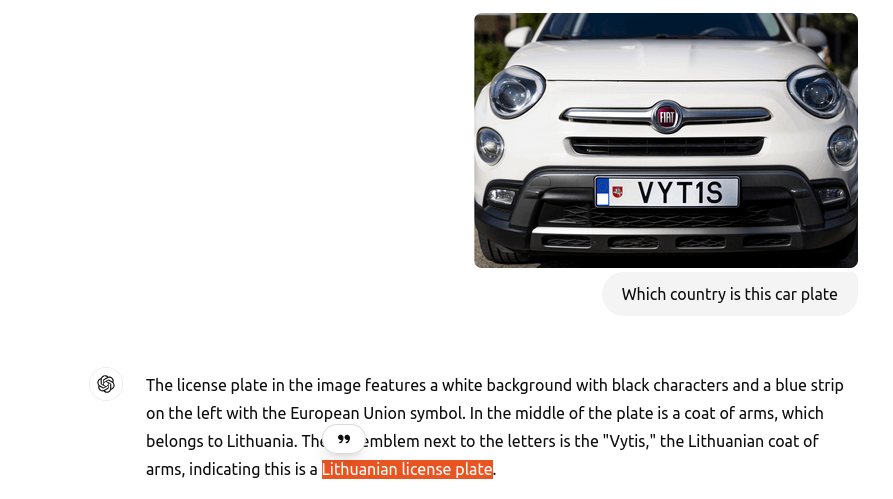

<h1> OSINT - Scanning Plates </h1>

**Table of Contents**
- [Description](#description)
- [Solution](#solution)

## Description
What country’s license place is this? The answer format is just the country’s name. 
Translated to Japanese:
このナンバープレートはどこの国のものですか？回答形式は国名のみです。

## Solution
I used ChatGPT to analyze the license plate of the image. And, ChatGPT indicated this is Lithuanian license plate. 
**Flag : Lithuania**

