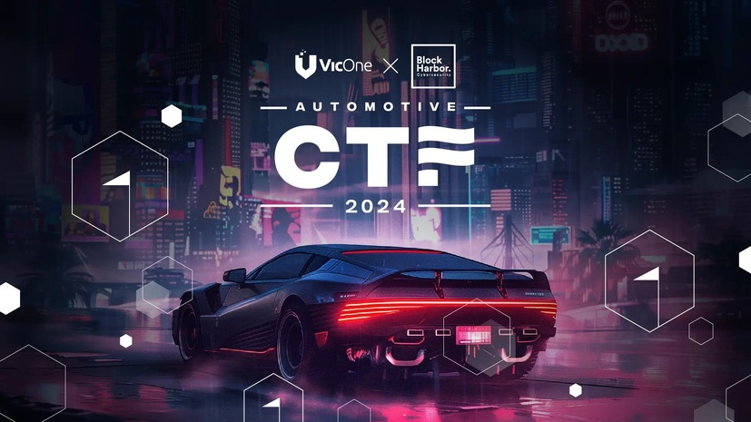

# Write-up for Automotive CTF 2024
This is my write-up of my solved challenges for preliminary round of [Automotive CTF 2024](https://vicone.com/jp/automotive-ctf).
Some challenges were solved after the event ended, therefore unable to check for the correct answer.

| Event | Automotive CTF Japan 2024   Preliminary round|
| --- | --- |
| **Organizer** | [VicOne](https://vicone.com/) x [Block Harbor](https://blockharbor.io/) |
| **Date** | 25 August 2024 ~ 8 September 2024 |
| **Venue** | Online |
| **Rules** | https://ctf.blockharbor.io/rules/jp |

## Index
|Category|Challenge|Description|
| --- | --- | --- |
|OSINT | [Scanning Plates](./OSINT-Scanning%20Plates/README.md) |What country’s license place is this? The answer format is just the country’s name.|
|OSINT | [I know a lot about cars](./OSINT-I%20know%20a%20lot%20about%20cars/README.md) |You say you know your cars. Let’s check how well you know them. What is the make and model of this vehicle? Write the answer using the following format: Make Model. For example: bh{Volkswagen_Beetle}|
|Stego | [Stego1](./Stego-Stego1/README.md) |Find the hidden text|
|Misc | [I Lost my Tesla NFC Card ](./Misc-I%20Lost%20my%20Tesla%20NFC%20Card/README.md)|Oh no! I lost my Tesla NFC Card and I can’t open my car. Luckily, I was able to hack into my hotel network which contains my NFC data. Can you please retrieve it?|
|Misc| [Gameboy Game](./Misc-Gameboy%20Game/README.md) |Who needs a defcon badge when you've got an emulator? Dodge some cones, have some fun.|
|Misc| [Hobbyist](./Misc-Hobbyist/README.md) | I found a malicious file uploaded on a locally hosted WordPress website for Car Enthusiast. Can you find it and get the flag for me? |
|We'll See in the Mach-E | [DID Access](./WSME-DID%20Access/README.md) | What negative response code was given for DID 0x4915?|
