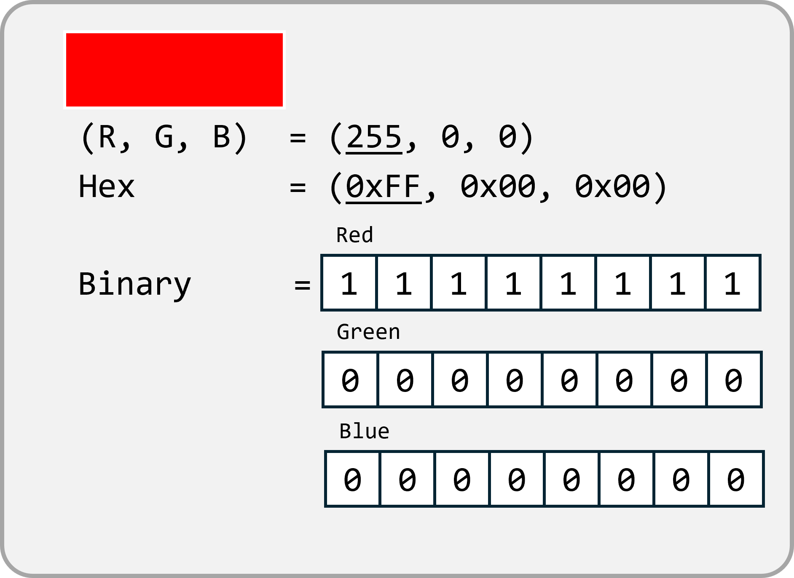
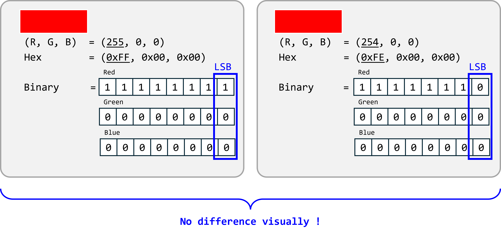
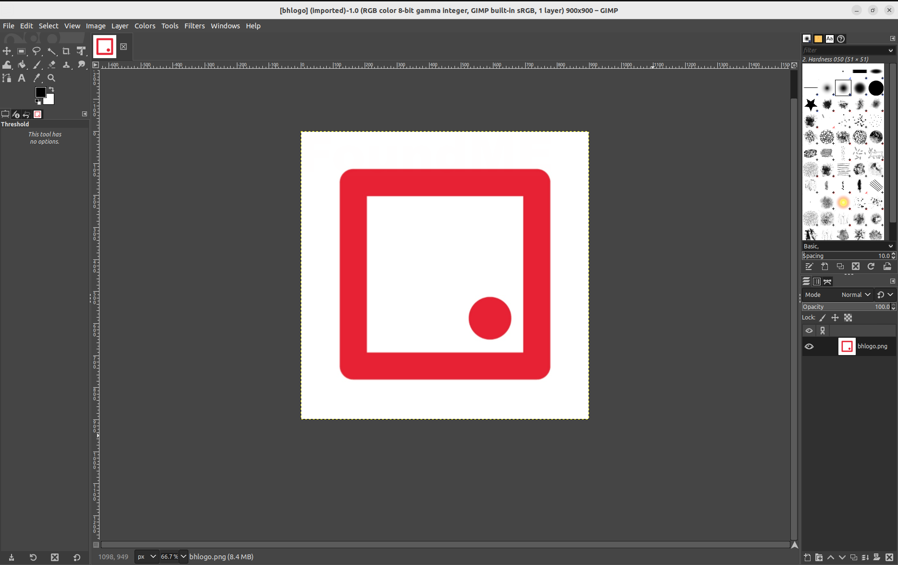
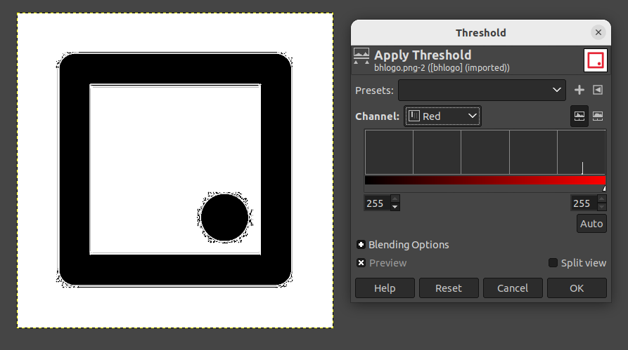
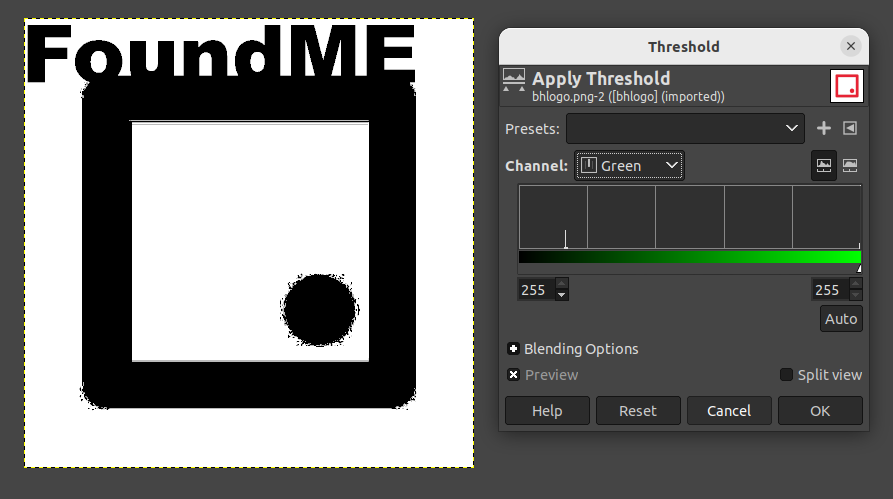
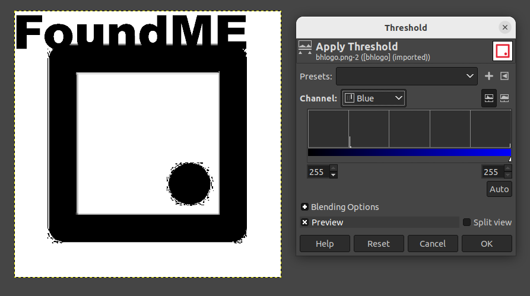

<h1> Stego - Stego1 </h1>

**Table of Contents**
- [Description](#description)
- [Solution](#solution)
  - [Image pixel value](#image-pixel-value)
  - [Steganography LSB principle](#steganography-lsb-principle)
  - [Analyzing the image](#analyzing-the-image)
    - [Threshold on Red Channel:](#threshold-on-red-channel)
    - [Threshold on Green channel:](#threshold-on-green-channel)
    - [Threshold on Blue channel:](#threshold-on-blue-channel)

## Description
Find the hidden text 
Translated to Japanese: 
隠されたテキストを見つけてください

## Solution

### Image pixel value
A pixel of an image consists of red, green, blue(R, G, B) value, each with 1 byte(value of 0 ~ 255) of color data. For example a red pixel is (255, 0, 0) represents 255 of red, 0 of blue and 0 of green.
 

### Steganography LSB principle
Modifying the LSB of pixels of an image is usually used to hide the image. 
LSB of a pixel has weight of 1, where modifying LSB makes no significant difference on the color visually.
For example, the image shown below of red(255, 0, 0) and red(254, 0, 0) has no difference that human eyes can identify.
 

This is modified LSB pixels are used to create a pattern of the hidden text.

### Analyzing the image
I used GIMP to analyze the image.

The image in the challenge is the Block Harbor logo and is quite simple, consists only red and white color.  First, I analyze the white pixel which is (255, 255, 255) in theory. Because hidden text is usually by modifying LSB pixel value, I exclude the value besides 255.

#### Threshold on Red Channel:

#### Threshold on Green channel:

#### Threshold on Blue channel:

By thresholding to 255 on each RGB channel, the hidden text `FoundME` was found on green and blue channel. 
**Flag : FoundME** 